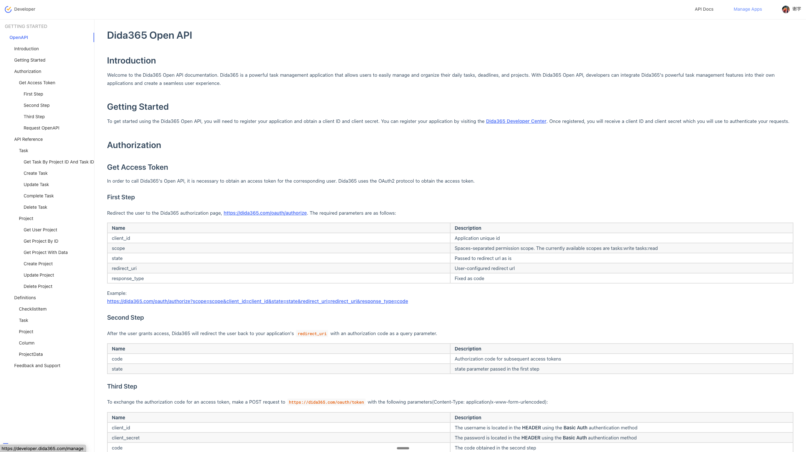
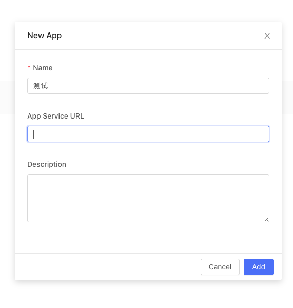

# 滴答清单 MCP 服务

滴答清单MCP（Memory-Context-Planning）服务是一个基于Python的后端服务，为用户提供目标管理、任务统计分析、关键词提取和任务-目标匹配等功能。该服务作为滴答清单主应用的辅助功能，帮助用户更好地规划和跟踪个人及团队目标完成情况。

> 最新更新：已从逆向接口切换到官方 OAuth 2.0 + Open API。详见 `docs/openapi_oauth_guide.md`。

> 重要：本项目已全面对齐滴答清单开放平台（/open/v1）端点。
> - 项目：GET/POST/POST(id)/DELETE /open/v1/project
> - 任务：POST /open/v1/task，POST /open/v1/task/{taskId}，POST 完成 /open/v1/project/{projectId}/task/{taskId}/complete，DELETE /open/v1/project/{projectId}/task/{taskId}
> - 汇总任务：官方无全局任务列表，使用 GET /open/v1/project/{projectId}/data 聚合
> - 标签：暂无写接口，当前工具仅提供只读聚合视图

## 主要功能

- **目标管理**：创建、查询、更新和删除个人目标
- **任务统计分析**：生成任务完成情况统计报告
- **关键词提取**：基于任务内容提取关键词（基于jieba分词）
- **任务与目标匹配**：智能匹配任务与相关目标
- **目标完成进度计算**：分析并可视化目标完成进度

## 安装要求

- Python 3.8+
- 滴答清单账号（支持通过token、手机号或邮箱进行认证）

## 快速开始

1) 克隆项目

```bash
git clone https://github.com/GalaxyXieyu/didatodolist-mcp.git
cd didatodolist-mcp
```

2) 安装依赖

```bash
pip install -r requirements.txt
```

3) 配置与认证（.env-only）

推荐使用 OAuth 2.0（仅 .env）：

获取 Client ID / Secret：
- 打开滴答清单开放平台文档入口：https://developer.dida365.com/docs#/openapi
- 在开放平台创建一个应用（填写名称）。
- 在应用设置中将 OAuth Redirect URL 填写为：`http://localhost:38000/callback`
- 复制应用的 `client_id` 与 `client_secret`，用于下方 `.env` 配置。

参考图：





- 在 `.env` 中配置 `MCP_API_KEY=...`、`DIDA_CLIENT_ID`、`DIDA_CLIENT_SECRET`；运行 `python scripts/oauth_authenticate.py --port 38000` 完成一次性授权，脚本会将 `DIDA_ACCESS_TOKEN`、`DIDA_REFRESH_TOKEN` 写入 `.env`。

最小可用步骤：

```bash
cp .env.example .env
# 编辑 .env，至少填写 MCP_API_KEY、DIDA_CLIENT_ID、DIDA_CLIENT_SECRET
python scripts/oauth_authenticate.py --port 38000  # 成功后写入 DIDA_ACCESS_TOKEN/DIDA_REFRESH_TOKEN 到 .env

# 启动服务
export MCP_API_KEY=your-strong-key  # 或直接在 .env 中配置
python main.py --sse --host 127.0.0.1 --port 3000
# 客户端请求头需带：x-api-key: your-strong-key
```

可选的 `.env` 示例：

```
MCP_API_KEY=your-strong-key
# 以下变量由 .env-only 管理
# DIDA_CLIENT_ID=...
# DIDA_CLIENT_SECRET=...
# DIDA_ACCESS_TOKEN=...
# DIDA_REFRESH_TOKEN=...
```

更多文档：
- 统一 OAuth 指南（.env-only）：`docs/openapi_oauth_guide.md`
- 文档索引：`docs/openapi_index.md`
- 项目接口：`docs/openapi_project.md`
- 任务接口：`docs/openapi_task.md`
- 数据模型定义：`docs/openapi_definitions.md`
- 本地调试（Inspector/mcp-cli）：`docs/dev_debug_inspector.md`

### Docker/Compose 部署（.env-only）

推荐在本机先完成一次性 OAuth 授权，把令牌写入 `.env` 后再部署容器（云上无需开放 38000）。

1) 本地预授权（写入 `.env`）

```bash
cp .env.example .env
# 填写 MCP_API_KEY、DIDA_CLIENT_ID、DIDA_CLIENT_SECRET
python scripts/oauth_authenticate.py --port 38000  # 成功后写入 DIDA_ACCESS_TOKEN / DIDA_REFRESH_TOKEN
```

2) 使用 Docker Compose 运行（仅需 3000 端口）

```bash
# 将授权后的 .env 复制为 data/.env（或直接放置）
mkdir -p data && cp .env data/.env

docker compose up -d --build mcp
# SSE 入口： http://<host>:3000/sse （Headers: x-api-key: <你的 MCP_API_KEY>）
```

3) 使用 MCP Inspector 或 mcp-cli 连接

- Inspector：`npx @modelcontextprotocol/inspector`，Transport 选 SSE，URL `http://<host>:3000/sse`，Headers `x-api-key: <你的 MCP_API_KEY>`
- mcp-cli：`npx @wong2/mcp-cli`，选择 SSE，填相同 URL 与 Headers

说明与最佳实践：
- callback(38000) 仅发生在“授权当时”，容器运行不依赖该端口；云上只需暴露 3000 或经反代直通 `/sse`。
- 强随机化 `MCP_API_KEY` 并通过反向代理透传 `x-api-key`；生产可限制来源 IP。
- 令牌过期时，服务端会尝试利用 `DIDA_REFRESH_TOKEN` 自动刷新；默认仅在内存更新，重启后继续从 `.env` 读取。

---

## 使用方法

### 启动（stdio）

```bash
python main.py
```

### 启动（SSE，推荐调试）

```bash
python main.py --sse --host 127.0.0.1 --port 3000
```

### 指定配置文件路径

已统一为 .env-only，不再支持单独的配置文件路径参数。

### 安装到 MCP 客户端

```bash
python main.py --install
```

## 端口与鉴权

- 回调端口（一次性授权）：`38000`
  - 与环境变量 `DIDA_REDIRECT_URI` 对齐，例如 `http://localhost:38000/callback`
  - 仅在运行 `scripts/oauth_authenticate.py` 进行 OAuth 授权时临时监听

- MCP 服务端口（SSE）：`3000`
  - 通过 `python main.py --sse --host 127.0.0.1 --port 3000` 启动
  - 客户端连接 MCP 时请在请求头携带 `x-api-key`

示例：

```bash
export MCP_API_KEY="your-strong-key"
python main.py --sse --host 127.0.0.1 --port 3000
# 客户端请求头：x-api-key: your-strong-key
```

## 端口与鉴权（摘要）

- 回调端口：38000（OAuth 回调一次性使用，与 `redirect_uri` 对齐）
- 服务端口：3000（SSE 连接 MCP 服务）
- 鉴权：客户端连接时需携带 `x-api-key`，服务端校验 `MCP_API_KEY`

## 认证机制（.env-only）

- 服务 → 官方 API：从 `.env` 读取 `DIDA_ACCESS_TOKEN`/`DIDA_REFRESH_TOKEN` 进行 OAuth 调用。
- 自动刷新：当返回 401 时，使用 `DIDA_REFRESH_TOKEN` 自动刷新并回写新的令牌到 `.env`。
- 不再支持手机号/邮箱密码直登；也不使用任何 `oauth_config.json`/`config.json` 文件。
- 客户端 → 服务：通过 `x-api-key` 请求头，服务端校验 `MCP_API_KEY`。

## 功能模块

### 目标管理

目标管理功能允许用户创建、跟踪和管理不同类型的目标：

- **阶段性目标**：有明确截止日期的短期目标
- **常规目标**：长期持续的目标
- **习惯性目标**：需要定期执行的行为习惯

### 统计分析

统计分析功能提供多维度的任务完成情况分析：

- **时间维度**：按日/周/月分析任务完成情况
- **项目维度**：按项目分类统计任务完成率
- **标签维度**：按标签分析任务分布

### 关键词提取

基于jieba分词库，从任务内容中提取关键词，支持生成词云和热度分析。

### 任务-目标匹配

使用内容相似度和关键词匹配算法，智能关联任务与目标，帮助用户将日常任务与长期目标对齐。

## 开发历程

本项目采用了系统化的开发方法，遵循以下开发阶段：

1. **规划阶段**：定义了项目范围、功能要求和技术规范
2. **架构设计**：完成核心数据结构的设计
3. **基础功能开发**：实现核心API和数据访问层
4. **高级功能实现**：开发统计分析和目标匹配算法
5. **优化与测试**：改进性能和用户体验

## 贡献

欢迎提交问题和改进建议！请fork本仓库并创建pull request。

## 许可证

[MIT许可证](LICENSE)
